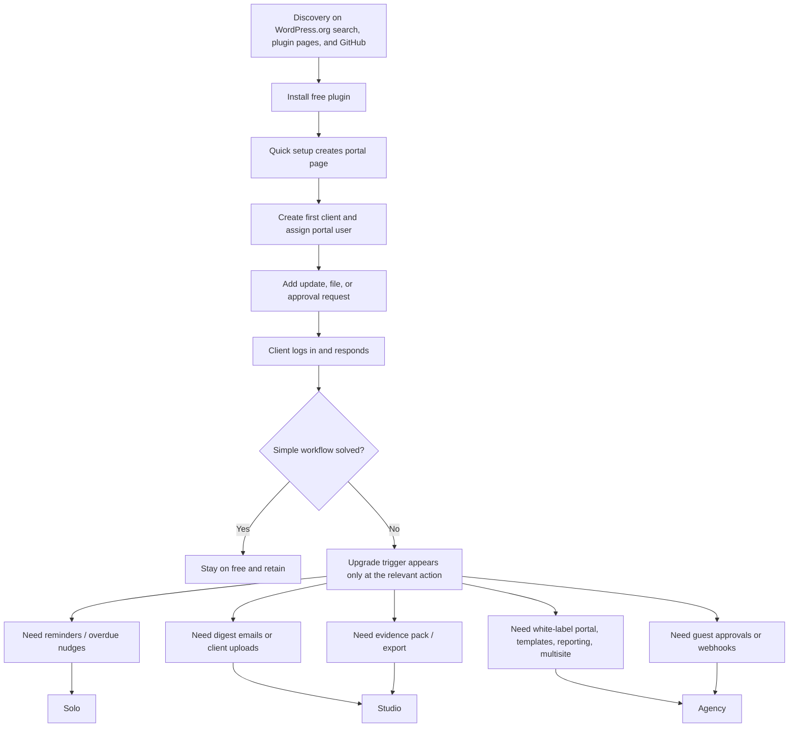

# SignoffFlow Free Version Strategy

## Executive summary

SignoffFlow should **not** move a large block of planned paid functionality into the free plugin. It **should** move a **thin but important layer of real approval depth** into free so the product actually demonstrates its promise during the first-use experience. Today, the public free plugin already offers a private client portal, an updates timeline, protected file sharing, client requests/tasks, basic email notifications, branding controls, quick setup, and an event log, but the request model exposed in the code is still fundamentally **binary** (`open` / `complete`). That makes the “client approval workflow” positioning weaker than it needs to be at the exact moment when new users are deciding whether the plugin is useful. citeturn1view0turn8view0turn9view1turn10view1turn11view0

My core recommendation is therefore: **move richer approval outcomes into free**—for example **Approved / Changes requested / Rejected / Blocked**, plus a short client response note and more readable per-item history—while **keeping reminders, overdue nudges, digest emails, client file uploads, evidence-pack exports, expanded logs/exports, white-labeling, templates/reporting/multisite, guest approvals, and webhooks/integrations in paid tiers**. That split is stronger for user acquisition, clearer for monetization, and more consistent with how adjacent products compete: free tools either solve a small complete job, or act as the on-ramp to a richer paid workflow; they do not usually win by hiding the core promise of the product behind the first paywall. fileciteturn0file0 citeturn29view1turn24view2turn32view0turn32view1

The immediate bottleneck appears to be **acquisition and activation**, not just roadmap depth. The WordPress.org listing is version 1.0.0, last updated one month ago, has **fewer than 10 active installs**, and has **no reviews**. That means better onboarding, more persuasive screenshots and demo assets, and a faster “first successful approval” experience are likely to produce more near-term upside than shipping a large volume of premium-only functionality into a product that still has a very small discovery surface. citeturn1view0turn31view1

## Research basis and current product

In practice, the usable primary inputs were the public listing on entity["organization","WordPress.org","plugin directory"], the public repository on entity["company","GitHub","developer platform"], the uploaded pricing PDF, and official competitor sites and docs. The supplied ChatGPT deep-research URL could not be evaluated because it redirected to the ChatGPT login page rather than exposing the underlying research publicly, so I treated it as unavailable. Because revenue targets and user metrics were unspecified, I optimized this analysis for acquisition, activation, conversion logic, support burden, maintenance cost, and policy compliance rather than for a numeric ARPU/CAC model. citeturn15view0 fileciteturn0file0

The current public SignoffFlow product is already more substantial than a bare portal plugin. Its WordPress.org page describes a private client workspace per account with project updates, protected file downloads, and client requests/tasks. The public repo and raw files show settings for portal page selection, logo URL/media ID, primary color, update/file/request email toggles, an onboarding action that can auto-create a portal page, and an event log that records events including email attempts. The plugin also stores files in a dedicated private uploads directory and serves them through an access-checked handler, which is a meaningful trust and security advantage for a portal product. citeturn1view0turn8view0turn9view1turn10view1

At the same time, the approval model is still thin. The request class currently allows only two statuses—`open` and `complete`—and the portal action flow lets client users complete a request, but not explicitly say “approved,” “changes requested,” “rejected,” or “blocked.” That matters because your uploaded pricing model already frames SignoffFlow around “frictionless approvals,” “audit-grade signoff proof,” and a premium ladder built around deeper approval behavior, reminders, uploads, exports, and agency branding. In other words, the public free product and the intended strategic positioning are directionally aligned, but the public free experience still undershoots the positioning. citeturn11view0turn3view1turn6view0 fileciteturn0file0

The technical path for extension looks reasonable. The repository is organized into separate classes for admin, portal, requests, files, clients, events, settings, updates, lifecycle, plugin setup, and approvals, and the main plugin file includes a Pro-active check plus an approvals schema helper. The repo is GPL v2 or later. That combination suggests you can extend the current structure without a rewrite and continue using a separate premium add-on model. Still, the current public trust signals are sparse: the GitHub repo has no website or topic metadata and no published releases, and the WordPress.org page has no reviews yet. citeturn6view0turn3view1turn2view1turn5view0turn1view0

## Competitive landscape

The market around SignoffFlow is split across three overlapping jobs: **simple private client portals**, **modular private-content/business suites**, and **visual feedback / approval tools**. This matters because users will compare SignoffFlow against whichever job they are trying to solve first, not necessarily against products with the same product philosophy. The simplest free portal alternatives already have meaningful traction: the free “Client Portal – Private user pages and login” plugin shows **3,000+ active installs** and a **4.3/5** rating, while WP Customer Area shows **10,000+ active installs** and a mature add-on ecosystem. Against that, SignoffFlow’s current problem is not that it lacks every premium feature on day one; it is that it has to prove its category value faster. citeturn28view1turn28view0turn1view0

| Product | Free / current entry | Paid / current offer | Strategic implication for SignoffFlow |
|---|---|---|---|
| SignoffFlow | Private portal, updates, protected files, requests/tasks, basic notifications, basic branding, event log, quick setup | Official stated roadmap: deeper approvals, advanced permissions, reminders/nudges, digests, client uploads, exports, white-labeling, templates, reporting, multisite, onboarding help | Good starting base, but the free tier still needs a more legible approval outcome before users will feel the differentiation |
| Client Portal – Private user pages and login | Simple private page per user after login; no built-in login/registration form | No paid tier indicated on the official plugin page | Proof that a narrowly scoped “simple and works” portal can earn installs if activation is easy |
| WP Customer Area | Secure customer area, private pages/files, appearance customization | Modular paid add-ons for notifications, projects, conversations, ownership rules, front-office publishing, auth forms, integrations, payments, and more | Strong precedent for freemium expansion, but also a warning against product sprawl and packaging complexity |
| Client Portal | No free directory tier found; commercial WordPress portal product | Unlimited portals/clients, notifications, private uploads, self-registration, multiple portals, client file handling | Portal polish, branded UX, and upload workflows are valued; you should benchmark presentation quality here, not feature breadth |
| SureFeedback | Free WordPress connector, but it requires a paid cloud account; official plugin documents guest commenting, mockups, assignments, status tracking, threaded discussion, internal notes | Paid plans include all features and scale by sites, mockups, team/workspace limits | Review/approval tools compete on **frictionless participation**, especially guest access and contextual change requests |
| Atarim | Free plan with essential collaboration tools, 2 active projects, 1 workspace, 1 seat | Paid plans scale seats, workspaces, active projects, and AI/business tooling; official docs show guest collaboration, page approval, and image/PDF/Figma review workflows | “No-login/low-login review plus approvals” is a premium-grade differentiator and should be built carefully, not given away early |

*Source note: the SignoffFlow row is synthesized from the current WordPress.org listing, public repo, and uploaded pricing model; the other rows come from the official product/plugin pages, official pricing pages, and official help/docs for the named products. citeturn1view0turn2view1turn3view1turn8view0turn11view0turn25view3turn28view1turn30view0turn26view2turn25view0turn25view1turn25view2turn28view3turn29view1turn33view2turn24view1turn24view2turn24view3 fileciteturn0file0*

The key strategic reading is straightforward. Compared with simple free portals, SignoffFlow already has more workflow substance. Compared with modular suites, it is refreshingly focused. Compared with entity["company","SureFeedback","website feedback"] and entity["company","Atarim","website collaboration"], it lacks low-friction review outcomes and guest participation. Compared with polished commercial portal products, it lacks presentation maturity and category proof. That combination argues for a focused move: **do not add bloated PM breadth; do add enough approval depth to make the free tier obviously useful**. citeturn25view3turn30view0turn25view1turn28view3turn24view2turn24view3

## Monetization and compliance constraints

The WordPress.org policy environment materially shapes what a sensible free/premium boundary looks like. The official Plugin Handbook says plugins in the directory must be GPL-compatible, that **trialware is not permitted**, that upsells are allowed only within the bounds of a non-hijacking admin experience, that SaaS models are permitted if they provide substantive service value and are documented, and that plugins may not contact external servers without explicit consent. It also says public-facing readmes must not spam, and that dashboard notices/prompts must be limited in scope and used sparingly. Your repository’s GPL v2-or-later license is already aligned with that baseline. citeturn31view0turn32view0turn32view1turn32view2turn32view3turn2view1

That has several practical consequences for SignoffFlow. First, avoid a directory strategy based on **count-based crippling**, time-limited trials, or quota walls that make the free plugin feel fake. A stronger WordPress.org strategy is to let free users solve a real small workflow, then charge for **speed, proof, brand control, or scale**. Second, keep any premium code in a **separate add-on/plugin or a clearly documented service layer**, rather than in a directory plugin that mostly exists to unlock code already shipped locally. Third, if you ever add a cloud-assisted mode—analytics, remote guest review, hosted approval links, or anything that sends data outward—follow the same disclosure pattern used by tools like SureFeedback Cloud: explicit external-service disclosure, opt-in connection, and clear security/privacy explanation in the readme. citeturn32view0turn32view3turn28view3

From a WordPress best-practice perspective, the current codebase is on a good path. The settings layer sanitizes values, the onboarding form uses nonce checks, request updates verify authentication and capabilities, and the plugin relies on WordPress APIs rather than inventing its own admin patterns. Official WordPress documentation explicitly recommends the Settings API for secure, consistent settings screens, notes that nonces and sanitization come with that tooling, and emphasizes validating/sanitizing inputs and escaping output. That means your next features should continue to be implemented the “WordPress way,” which will reduce both review risk and long-term maintenance cost. citeturn8view0turn10view1turn11view0turn31view2turn31view3turn31view4turn31view5

The most important operational trade-off is this: **not all premium features cost the same to support**. Reminders, overdue nudges, and digests are excellent paid features because agencies understand their value immediately, but they increase dependency on SMTP setup, WordPress mail transport, and cron reliability. Client uploads add storage, file-size, MIME-type, permissions, and abuse-spam support overhead. Magic links or guest approvals are attractive, but they are a different security model from the current one because today access is based on assigned WordPress users. By contrast, evidence packs and exports build on the existing event/audit concept and are both defensible and comparatively lower-friction to support once implemented. citeturn1view0turn9view1turn11view0 fileciteturn0file0

## Prioritized recommendations

The dev-hour ranges below are **analytical estimates**, not commitments. They assume one experienced WordPress/PHP engineer working within the current modular class structure, with light QA/copy polish but without counting substantial design or content-production work outside the plugin itself. citeturn6view0turn3view1

| Priority | Recommendation | Impact | Complexity | Est. dev hours | Ongoing cost | Suggested window |
|---|---|---:|---:|---:|---:|---|
| High | **Move richer approval outcomes into free**: replace binary completion with `Approved / Changes requested / Rejected / Blocked`, add a short client response note, better labels/badges, and a clearer request history | Very high | Low–Medium | 20–30 | Low | Immediate |
| High | **Improve activation and trust**: stronger onboarding checklist, sample/demo content, clearer screenshots/captions, tighter WP.org copy, live demo link, better GitHub metadata/releases | Very high | Low–Medium | 16–24 | Low or negative | Immediate |
| High | **Keep reminders, overdue nudges, and digest emails paid** and build them as the first premium feature family | High | Medium | 24–40 | Medium | Next |
| High | **Keep evidence pack export and expanded activity exports paid** and build them as the second premium layer | High | Medium–High | 30–50 | Low–Medium | Next |
| Medium | **Keep client file uploads paid**; do not move them into free at this stage | Medium | Medium | 20–35 | High | After core premium layer |
| Medium | **Defer magic links / guest approvals to later paid rollout** with explicit security review, expiry/revocation model, and audit mapping | High strategic value | High | 40–70 | High | Later |
| Medium | **Add outbound webhooks/integration pack after the core value ladder is proven** | Medium–High | Medium | 20–35 | Medium | Later |
| Ongoing guardrail | **Do not add broad PM breadth**—chat, invoicing, kanban, CRM-style modules—to the free tier just to look competitive | High strategic value | Low decision complexity | 0 | Negative if avoided | Ongoing |

*Source note: this priority order is based on the current feature surface and request model in SignoffFlow, the uploaded packaging roadmap, official competitor positioning, and WordPress.org policy constraints. fileciteturn0file0 citeturn1view0turn11view0turn25view1turn28view3turn24view2turn32view0turn32view1*

The one deliberate place where I would **override** the uploaded pricing model is this: the PDF suggests keeping “approvals beyond simple completion” in paid tiers. In the abstract, that is clean packaging. In the current market, however, I think that boundary is a little too strict for acquisition. If the free product is called a client approval workflow, free users should be able to experience at least the **first meaningful layer of approval semantics** before paying. That does **not** require moving reminders, uploads, exports, white-labeling, or guest access into free. It just requires making the free workflow feel like an approval product instead of a branded request checklist. fileciteturn0file0 citeturn11view0turn24view2turn29view1

From a monetization standpoint, the best structure remains the annual **Free / Solo / Studio / Agency** ladder in your uploaded model. I would keep it feature-led rather than seat-led, because the closest WordPress-native competitors monetize mostly through capabilities, branding, uploads, or modular add-ons, whereas the more SaaS-like tools monetize through teams, workspaces, and scale. At this stage, SignoffFlow’s strongest paid story is not “more of the same portal,” but “less chasing, better proof, cleaner client presentation, and agency-scale workflow.” fileciteturn0file0 citeturn26view2turn25view2turn29view1turn24view0

## Proposed free version and conversion funnel

The proposed free tier should be **meaningfully useful for freelancers and small agencies running simple approvals**, while paid tiers should unlock the features that save time every week, reduce client-risk exposure, and improve agency presentation. That is the cleanest way to increase top-of-funnel installs without collapsing the upgrade logic. citeturn1view0turn10view1 fileciteturn0file0

| Capability | Current free | Proposed free | Paid boundary |
|---|---|---|---|
| Private client portal | Yes | Keep | Core free value |
| Updates timeline | Yes | Keep | Core free value |
| Protected file sharing | Yes | Keep | Core free value |
| Requests / tasks | Yes, but binary | **Upgrade to real approval outcomes** with response note | Advanced automation remains paid |
| Basic email notifications | Yes | Keep | Reminders / nudges / digests stay paid |
| Basic branding | Logo + primary color + stable styling hooks | Keep | White-label portal + branded emails/templates stay paid |
| Quick setup | Yes | **Expand with sample/demo content and first-run checklist** | No paid wall needed |
| Event log | Yes, primarily admin-facing | Keep, and expose a light human-readable activity trail per request | Exports / evidence packs stay paid |
| Advanced permissions | Not currently a clear free differentiator | Keep paid | Strong Solo+ value |
| Client file uploads | No | Keep paid | Studio+ value; higher support/storage burden |
| Reminders / overdue nudges / digests | No | Keep paid | Clear automation upgrade |
| Approval evidence pack / export | No | Keep paid | Strongest defensible premium value |
| Reporting / templates / multisite | No | Keep paid | Agency anchor |
| Magic links / guest approvals | No | Keep paid and later | High-value differentiator, but security-heavy |
| Webhooks / integrations | No | Keep paid and later | Agency-stack fit, not free-core necessity |
| Broad PM extras | No | **Do not add** | Stay out of scope |

*Source note: current-free columns are based on the public WordPress.org listing and public repo/settings/request code; paid-boundary decisions reflect the uploaded pricing model and this report’s outcome-based adjustment to move only the first layer of approval depth into free. citeturn1view0turn8view0turn9view1turn10view1turn11view0 fileciteturn0file0*

The conversion funnel below is the model I would optimize for. It intentionally lets free users succeed on a simple job and only introduces upgrades at the points where a real agency workflow starts needing automation, proof, white-labeling, or lower-friction external collaboration. That approach is also the safest fit with WordPress.org’s guidance that upgrade prompts be limited in scope and used sparingly. citeturn1view0turn10view1turn32view1 fileciteturn0file0

The upgrade prompt rules should be strict. Show the reminder upgrade prompt **only** when a user tries to schedule follow-ups; show the export/evidence upgrade prompt **only** when they reach for proof; show the white-label upgrade prompt **only** on brand/email/template screens; show guest-approval/webhook upgrades **only** when users try to invite clients without accounts or connect other tools. That keeps the free version genuinely useful, improves review sentiment, and stays close to WordPress.org’s rules on admin experience, upsells, external-service disclosure, and non-trialware packaging. citeturn32view0turn32view1turn32view2turn32view3